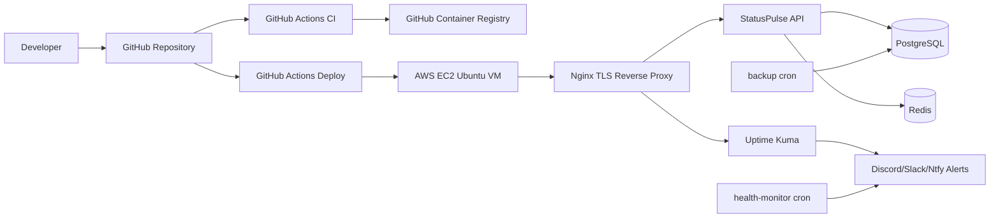

# StatusPulse

StatusPulse is a lightweight FastAPI status page and health monitoring API deployed with Docker, GitHub Actions, AWS EC2, Nginx, Let's Encrypt, Uptime Kuma, and Terraform.

## Architecture



## Prerequisites

- Docker and Docker Compose
- `make`, `curl`, and Python 3 for local testing
- GitHub public repository
- AWS account, EC2 key pair, and AWS credentials for Terraform
- Domain or subdomain pointing to the EC2 public IP
- Optional Route 53 hosted zone if you want Terraform to create DNS records

AWS public IPv4 and Route 53 can incur small charges depending on your account. Destroy the AWS stack after assessment if you do not need it.

## Run Locally

```bash
cp .env.example .env
make build
make up
make test
```

Useful proof commands:

```bash
docker images statuspulse
docker compose ps
curl -fsS http://localhost:8000/health | python -m json.tool
bash tests/test_integration.sh
```

Stop the local stack:

```bash
make down
```

Remove containers, images, and volumes:

```bash
make clean
```

## CI/CD

`.github/workflows/ci.yml` runs on pushes and PRs to `main`:

- Ruff linting
- Hadolint Dockerfile scan
- Docker image build
- Full Docker Compose stack startup
- Integration tests against live endpoints
- Test report artifact upload

`.github/workflows/deploy.yml` runs after CI succeeds on `main`:

- Builds SHA and `latest` tags
- Pushes to GitHub Container Registry
- SSHes to the AWS EC2 server
- Runs `scripts/deploy.sh`
- Checks `/health`
- Sends a Discord notification when `DISCORD_WEBHOOK_URL` is configured

Required GitHub Actions secrets:

```text
DEPLOY_HOST=<ec2-public-ip-or-domain>
DEPLOY_PORT=2222
DEPLOY_USER=deploy
DEPLOY_SSH_KEY=<private key for deploy user>
APP_HEALTH_URL=https://statuspulse.example.com/health
DISCORD_WEBHOOK_URL=<optional>
```

## AWS Deployment

1. Push this repo to a public GitHub repository.
2. Build and push an initial image through GitHub Actions, or manually:

```bash
docker build -t ghcr.io/YOUR_USERNAME/statuspulse:latest .
docker push ghcr.io/YOUR_USERNAME/statuspulse:latest
```

3. Provision AWS infrastructure:

```bash
cd terraform
cp terraform.tfvars.example terraform.tfvars
terraform init
terraform apply
```

4. Point `DOMAIN` and `STATUS_DOMAIN` to the EC2 public IP. If using Route 53, set `route53_zone_id` in `terraform.tfvars`.

5. SSH to the instance:

```bash
ssh -p 2222 deploy@<instance_public_ip>
```

6. On the server, create `/opt/statuspulse/.env` from `.env.example` if Terraform did not write it. Set strong values for `DB_PASSWORD`, `REDIS_PASSWORD`, `DOMAIN`, `STATUS_DOMAIN`, `LETSENCRYPT_EMAIL`, `GHCR_IMAGE`, and `HEALTH_URL`.

7. Bootstrap TLS after DNS resolves:

```bash
cd /opt/statuspulse
sudo ./scripts/bootstrap-tls.sh
```

8. Deploy:

```bash
cd /opt/statuspulse
sudo APP_IMAGE=ghcr.io/YOUR_USERNAME/statuspulse:latest ./scripts/deploy.sh
```

The deploy script starts the inactive blue/green app container, checks `/health`, switches Nginx upstream, runs an external health check, and rolls back if the new image fails.

## Monitoring And Alerting

Uptime Kuma is available at:

```text
https://status.<your-domain>/
```

Configure these monitors in the Uptime Kuma UI:

- HTTP monitor: `https://<your-domain>/health`, every 60 seconds
- TCP monitor: host `postgres`, port `5432`
- TCP monitor: host `redis`, port `6379`
- TLS certificate monitor: `<your-domain>`

Create a public status page in Uptime Kuma and add at least two notification channels, such as Discord and Ntfy.sh.

The server cron health monitor runs `scripts/health-monitor.sh` every 5 minutes. It checks API health, disk usage, memory usage, expected Docker containers, and TLS expiry. Alerts go to `ALERT_WEBHOOK_URL`.

Manual cron entries if needed:

```cron
*/5 * * * * cd /opt/statuspulse && ./scripts/health-monitor.sh
0 2 * * * cd /opt/statuspulse && ./scripts/backup.sh
```

## Backup And Restore

Create a compressed PostgreSQL backup:

```bash
cd /opt/statuspulse
sudo ./scripts/backup.sh
```

Backups are written as:

```text
backups/statuspulse_db_YYYY-MM-DD_HHMMSS.sql.gz
```

Only the latest 7 backups are retained. If `S3_BUCKET` is set and the AWS CLI is installed, the backup script uploads the dump to S3.

Restore to a fresh database:

```bash
cd /opt/statuspulse
set -a
. ./.env
set +a
gzip -dc backups/statuspulse_db_YYYY-MM-DD_HHMMSS.sql.gz | docker exec -i statuspulse-postgres psql -U "$DB_USER" "$DB_NAME"
```

## Security

- App container runs as a non-root user.
- Runtime image uses `python:3.12-alpine` and keeps build dependencies out of the final image.
- `.env` is ignored by Git.
- GitHub Actions uses repository secrets for deployment credentials.
- Nginx enforces HTTPS redirects, security headers, and `100r/m` rate limiting per IP.
- SSH is moved to a custom port, root login is disabled, password auth is disabled, UFW is enabled, and unattended upgrades are installed through Terraform cloud-init.

See [SECURITY.md](SECURITY.md) for scan and hardening details.

## Troubleshooting

- `docker compose` fails because `.env` is missing: run `cp .env.example .env`.
- App is unhealthy: check `docker compose logs app postgres redis`.
- Redis health check fails: make sure `REDIS_PASSWORD` matches in `.env`.
- TLS bootstrap fails: confirm DNS points to the EC2 public IP and port 80 is reachable.
- Deploy rolls back: inspect `/opt/statuspulse/deploy.log` and `docker logs statuspulse-app-blue` or `statuspulse-app-green`.
- Uptime Kuma cannot reach Postgres or Redis: use Docker service names `postgres` and `redis`, not localhost.

## Proof Checklist

Store proof screenshots in `screenshots/`:

- Docker image under 200 MB
- `docker compose ps` with app, PostgreSQL, and Redis healthy
- `/health` returning all healthy
- Successful CI runs and one intentionally failed CI run
- GHCR SHA-tagged images
- Successful deployment run
- HTTPS Swagger UI
- TLS certificate output
- UFW status and SSH hardening
- Uptime Kuma dashboard and public status page
- Alert down and recovery notifications
- Terraform apply output
- Backup and restore output
- Trivy before/after scan
- Security headers and rate-limit demo
